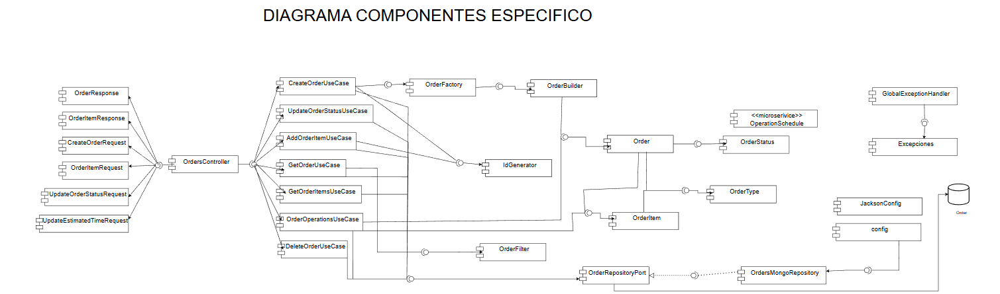
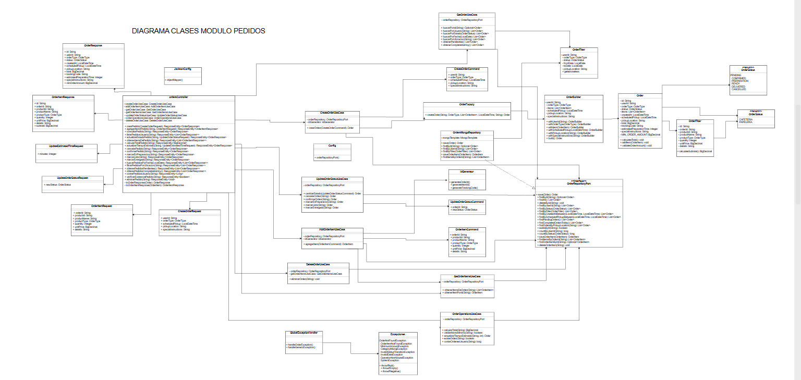
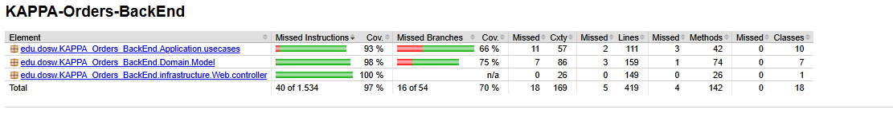
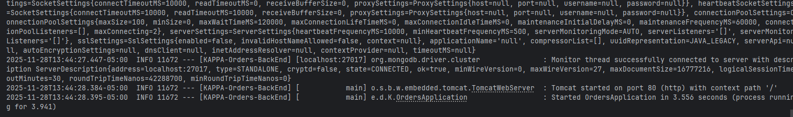

# 📚 ECIEXPRESS - ORDERS

> <b>Gestionamiento de compras en papelerias y cafeterias</b>

---

## 📑 Tabla de Contenidos

1. 👤 [Integrantes](#1--integrantes)
2. 🎯 [Objetivo del Proyecto](#2--objetivo-del-proyecto)
3. ⚡ [Funcionalidades principales](#3--funcionalidades-principales)
4. 📋 [Manejo de Estrategia de versionamiento y branches](#4--manejo-de-estrategia-de-versionamiento-y-branches)
    - 4.1 [Convenciones para crear ramas](#41-convenciones-para-crear-ramas)
    - 4.2 [Convenciones para crear commits](#42-convenciones-para-crear-commits)
5. ⚙️ [Tecnologías utilizadas](#5--tecnologias-utilizadas)
6. 🧩 [Funcionalidad](#6--funcionalidad)
7. 📊 [Diagramas](#7--diagramas)
    - 7.1 🟩 [Diagrama de Contexto](#71--diagrama-de-contexto)
    - 7.2 🟦 [Diagrama de Casos de Uso](#72--diagrama-de-casos-de-uso)
    - 7.3 🟨 [Diagrama de Clases](#73--diagrama-de-clases)
    - 7.4 🟥 [Diagrama de Componentes — General](#74--diagrama-de-componentes--general)
    - 7.5 🟨 [Diagrama de Componentes — Específico (Backend)](#75--diagrama-de-componentes--especifico-backend)
    - 7.6 🟩 [Diagrama de Base de Datos (MongoDB)](#76--diagrama-de-base-de-datos-mongodb)
    - 7.7 🛰️ [Diagrama de Despliegue](#77--diagrama-de-despliegue)
8. 🌐 [Endpoints expuestos y su información de entrada y salida](#8--endpoints-expuestos-y-su-informacion-de-entrada-y-salida)
9. ⚠️ [Manejo de Errores](#9--manejo-de-errores)
10. 🧪 [Evidencia de las pruebas y cómo ejecutarlas](#10--evidencia-de-las-pruebas-y-como-ejecutarlas)
11. 🗂️ [Código de la implementación organizado en las respectivas carpetas](#11--codigo-de-la-implementacion-organizado-en-las-respectivas-carpetas)
12. 📝 [Código documentado](#12--codigo-documentado)
13. 🧾 [Pruebas coherentes con el porcentaje de cobertura expuesto](#13--pruebas-coherentes-con-el-porcentaje-de-cobertura-expuesto)
14. 🚀 [Ejecución del Proyecto](#14--ejecucion-del-proyecto)
15. ☁️ [Evidencia de CI/CD y Despliegue en Azure](#15--evidencia-de-cicd-y-despliegue-en-azure)
16. 🤝 [Contribuciones y agradecimientos](#16--contribuciones-y-agradecimientos)


---

## 1. 👤 Integrantes:

- Daniel Rodríguez
- Julián Arenas
- Belén Quintero
- Marlio Charry
- Juan Pablo Contreras

## 2. 🎯 Objetivo del Proyecto

En la actualidad, las cafeterias y papelerias dentro de nuestro campus universitario se presentan serias dificultades
operativas durante las horas pico. Estudiantes, docentes y personal administrativo deben enfrentar largas filas y
esperas prolongadas para adquirir sus alimentos o materiales pedidos, lo que genera gran perdida de tiempo, generando
retrasos a clases, desorganizacon y una mala experiencia tanto para los usuarios como para los trabajadores.

El modelo de atención presencial genera mucha agromelación, errores en pedidos y pagos, poca trazabilidad en las ventas,
generando poca eficiencia operativa. Por lo cual se requiere un sistema digital que optimice los procesos de compra, para
reducir los tiempos de espera y mejorando la experiencia de todos.

---

# 3. ⚡ Funcionalidades principales

El microservicio de **Gestión de Pedidos** proporciona una solución completa para la administración de pedidos dentro del sistema ECIXPRESS. A continuación se detallan las funcionalidades principales implementadas:

## 🛒 **Gestión Completa de Pedidos**

### **Creación y Configuración de Pedidos**
-  **Creación de nuevos pedidos** con información completa del usuario
-  **Configuración de tipo de pedido** y ubicación de recogida
-  **Instrucciones especiales** para personalización del servicio
-  **Programación de recogidas** en horarios específicos
-  **Generación automática de códigos de tracking** únicos

### **Gestión de Ítems y Productos**
-  **Agregar múltiples ítems** a un pedido existente
-  **Validación de montos mínimos** (mínimo 5000 unidades monetarias)
-  **Cálculo automático de subtotales** por cada ítem
-  **Gestión de detalles específicos** por producto
-  **Diferentes tipos de productos** con categorización

##  **Flujo de Estados del Pedido**

### **Estados Disponibles**
El sistema maneja un flujo completo de estados que incluye:
- **PENDIENTE** - Pedido creado pero no confirmado
-  **CONFIRMADO** - Pedido aceptado y en proceso
-  **EN_PREPARACION** - Pedido siendo preparado
-  **LISTO** - Pedido preparado para recoger
-  **ENTREGADO** - Pedido completado exitosamente
-  **CANCELADO** - Pedido cancelado por el usuario o sistema

### **Transiciones de Estado**
-  **Confirmación manual** de pedidos
- **Marcado automático** en preparación
-  **Notificación cuando está listo**
-  **Registro de entrega** completada
-  **Cancelación controlada** con validaciones

## 📊 **Consultas y Búsquedas Avanzadas**

### **Búsquedas por Diferentes Criterios**
-  **Por ID específico** de pedido
-  **Por usuario** - todos los pedidos de un cliente
-  **Por fecha** - pedidos de un día específico
-  **Por ubicación** - pedidos por punto de recogida
-  **Por estado** - filtrado por estado actual
-  **Pedidos pendientes** - listado de pendientes
-  **Pedidos completados hoy** - reporte diario

### **Consultas Especializadas**
-  **Historial completo** por usuario
-  **Conteo de pedidos** por usuario
-  **Verificación de existencia** de pedidos
-  **Detalles completos de ítems** por pedido

## 💰 **Cálculos y Operaciones Financieras**

### **Gestión de Totales y Montos**
- **Cálculo automático de totales** del pedido
-  **Validación de montos mínimos** requeridos
-  **Cálculo de subtotales** por cada ítem
-  **Gestión de tiempos estimados** de preparación

### **Actualización de Tiempos**
- **Configuración de tiempo estimado** de preparación
- **Validación de tiempos válidos** (no negativos)
- **Actualización dinámica** de tiempos

## 🗂️ **Operaciones de Mantenimiento**

### **Gestión de Datos**
-  **Eliminación controlada** de pedidos
- **Validación de estado** para eliminación
- **Manejo de errores** y excepciones
- **Respuestas HTTP estandarizadas**

### **Validaciones y Seguridad**
-  **Validación de datos de entrada**
-  **Manejo de errores con códigos HTTP apropiados**
-  **Protección contra operaciones inválidas**
- **Transiciones de estado validadas**

## 📱 **Características Técnicas**

### **API REST Completa**
- **22 endpoints** bien definidos
- **Operaciones CRUD** completas
-  **Manejo de estados** con PUT específicos
-  **Múltiples formatos de respuesta** (individual, lista, boolean, numérico)

### **Manejo de Respuestas**
- **Respuestas HTTP estandarizadas** (200, 400, 404, 204)
- **Mensajes descriptivos** de error
- **Transformación de datos** entre capas
- **Persistencia eficiente** de información

### **Escalabilidad y Mantenibilidad**
-  **Arquitectura por capas** bien definida
- **Separación de responsabilidades** clara
- **Fácil extensión** para nuevas funcionalidades
- **Manejo robusto** de casos edge

## 🎯 **Ventajas del Sistema**

### **Para los Usuarios**
- **Experiencia fluida** en la gestión de pedidos
- **Múltiples formas** de consultar y gestionar pedidos
- **Seguimiento en tiempo real** del estado
- **Transparencia total** en costos y tiempos

### **Para los Administradores**
- **Visibilidad completa** del flujo de pedidos
- **Múltiples filtros** para gestión eficiente
- **Reportes automáticos** de actividad
- 🛡**Control total** sobre operaciones críticas

### **Para los Desarrolladores**
- **API bien documentada** y consistente
- **Flujos predecibles** y bien definidos
- **Manejo robusto** de errores
-  **Fácil integración** con otros sistemas

El microservicio de Gestión de Pedidos está diseñado para ser **robusto, escalable y fácil de usar**, proporcionando 
una base sólida para el sistema de pedidos de ECIXPRESS con capacidad para crecer y adaptarse a futuras necesidades del 
negocio.


## 4. 📋 Manejo de Estrategia de versionamiento y branches

### Estrategia de Ramas (Git Flow)


### Ramas y propósito
- Manejaremos GitFlow, el modelo de ramificación para el control de versiones de Git

#### `main`
- **Propósito:** rama **estable** con la versión final (lista para demo/producción).
- **Reglas:**
    - Solo recibe merges desde `release/*` y `hotfix/*`.
    - Cada merge a `main` debe crear un **tag** SemVer (`vX.Y.Z`).
    - Rama **protegida**: PR obligatorio, 1–2 aprobaciones, checks de CI en verde.

#### `develop`
- **Propósito:** integración continua de trabajo; base de nuevas funcionalidades.
- **Reglas:**
    - Recibe merges desde `feature/*` y también desde `release/*` al finalizar un release.
    - Rama **protegida** similar a `main`.

#### `feature/*`
- **Propósito:** desarrollo de una funcionalidad, refactor o spike.
- **Base:** `develop`.
- **Cierre:** se fusiona a `develop` mediante **PR**


#### `release/*`
- **Propósito:** congelar cambios para estabilizar pruebas, textos y versiones previas al deploy.
- **Base:** `develop`.
- **Cierre:** merge a `main` (crear **tag** `vX.Y.Z`) **y** merge de vuelta a `develop`.
- **Ejemplo de nombre:**  
  `release/1.3.0`

#### `hotfix/*`
- **Propósito:** corregir un bug **crítico** detectado en `main`.
- **Base:** `main`.
- **Cierre:** merge a `main` (crear **tag** de **PATCH**) **y** merge a `develop` para mantener paridad.
- **Ejemplos de nombre:**  
  `hotfix/fix-blank-screen`, `hotfix/css-broken-header`


---

### 4.1 Convenciones para **crear ramas**

#### `feature/*`
**Formato:**
```
feature/[nombre-funcionalidad]-ECIEXPRESS_[codigo-jira]
```

**Ejemplos:**
- `feature/readme_ECIEXPRESS-34`

**Reglas de nomenclatura:**
- Usar **kebab-case** (palabras separadas por guiones)
- Máximo 50 caracteres en total
- Descripción clara y específica de la funcionalidad
- Código de Jira obligatorio para trazabilidad

#### `release/*`
**Formato:**
```
release/[version]
```
**Ejemplo:** `release/1.3.0`

#### `hotfix/*`
**Formato:**
```
hotfix/[descripcion-breve-del-fix]
```
**Ejemplos:**
- `hotfix/corregir-pantalla-blanca`
- `hotfix/arreglar-header-responsive`

---

### 4.2 Convenciones para **crear commits**

#### **Formato:**
```
[codigo-jira] [tipo]: [descripción específica de la acción]
```

#### **Tipos de commit:**
- `feat`: Nueva funcionalidad
- `fix`: Corrección de errores
- `docs`: Cambios en documentación
- `style`: Cambios de formato/estilo (espacios, punto y coma, etc.)
- `refactor`: Refactorización de código sin cambios funcionales
- `test`: Agregar o modificar tests
- `chore`: Tareas de mantenimiento, configuración, dependencias

#### **Ejemplos de commits específicos:**
```bash
#  BUENOS EJEMPLOS
git commit -m "26-feat: agregar validación de email en formulario login"
git commit -m "24-fix: corregir error de navegación en header mobile"


#  EVITAR 
git commit -m "23-feat: agregar login"
git commit -m "24-fix: arreglar bug"

```

#### **Reglas para commits específicos:**
1. **Un commit = Una acción específica**: Cada commit debe representar un cambio lógico y completo
2. **Máximo 72 caracteres**: Para que sea legible en todas las herramientas Git
3. **Usar imperativo**: "agregar", "corregir", "actualizar" (no "agregado", "corrigiendo")
4. **Ser descriptivo**: Especificar QUÉ se cambió y DÓNDE
5. **Commits frecuentes**: Mejor muchos commits pequeños que pocos grandes

#### **Beneficios de commits específicos:**
-  **Rollback preciso**: Poder revertir solo la parte problemática
-  **Debugging eficiente**: Identificar rápidamente cuándo se introdujo un bug
-  **Historial legible**: Entender la evolución del código
-  **Colaboración mejorada**: Reviews más fáciles y claras


---


## 5. ⚙️Tecnologías utilizadas

El backend del sistema ECIEXPRESS fue desarrollado con una arquitectura basada en **Spring Boot** y componentes del ecosistema **Java**, garantizando modularidad, mantenibilidad, seguridad y facilidad de despliegue.  
A continuación se detallan las principales tecnologías empleadas en el proyecto:

| **Tecnología / Herramienta** | **Versión / Framework** | **Uso principal en el proyecto** |
|------------------------------|--------------------------|----------------------------------|
| **Java OpenJDK** | 17 | Lenguaje de programación base del backend, orientado a objetos y multiplataforma. |
| **Spring Boot** | 3.x | Framework principal para la creación del API REST, manejo de dependencias e inyección de componentes. |
| **Spring Web** | — | Implementación del modelo MVC y exposición de endpoints REST. |
| **Spring Security** | — | Configuración de autenticación y autorización de usuarios mediante roles y validación de credenciales. |
| **Spring Data MongoDB** | — | Integración con la base de datos NoSQL MongoDB mediante el patrón Repository. |
| **MongoDB Atlas** | 6.x | Base de datos NoSQL en la nube utilizada para almacenar las entidades del sistema. |
| **Apache Maven** | 3.9.x | Gestión de dependencias, empaquetado del proyecto y automatización de builds. |
| **Lombok** | — | Reducción de código repetitivo con anotaciones como `@Getter`, `@Setter`, `@Builder` y `@AllArgsConstructor`. |
| **JUnit 5** | — | Framework para pruebas unitarias que garantiza el correcto funcionamiento de los servicios. |
| **Mockito** | — | Simulación de dependencias para pruebas unitarias sin requerir acceso a la base de datos real. |
| **JaCoCo** | — | Generación de reportes de cobertura de código para evaluar la efectividad de las pruebas. |
| **SonarQube** | — | Análisis estático del código fuente y control de calidad para detectar vulnerabilidades y malas prácticas. |
| **Swagger (OpenAPI 3)** | — | Generación automática de documentación y prueba interactiva de los endpoints REST. |
| **Postman** | — | Entorno de pruebas de la API, utilizado para validar respuestas en formato JSON con los métodos `POST`, `GET`, `PATCH` y `DELETE`. |
| **Docker** | — | Contenerización del servicio para garantizar despliegues consistentes en distintos entornos. |
| **Azure App Service** | — | Entorno de ejecución en la nube para el despliegue automático del backend. |
| **Azure DevOps** | — | Plataforma para la gestión ágil del proyecto, seguimiento de tareas y control de versiones. |
| **GitHub Actions** | — | Configuración de pipelines de integración y despliegue continuo (CI/CD). |
| **SSL / HTTPS** | — | Implementación de certificados digitales para asegurar la comunicación entre cliente y servidor. |

> 🧠 Estas tecnologías fueron seleccionadas para asegurar **escalabilidad**, **modularidad**, **seguridad**, **trazabilidad** y **mantenibilidad** del sistema, aplicando buenas prácticas de ingeniería de software y estándares de desarrollo moderno.


## 6. 🧩 Funcionalidad

El microservicio de **Gestión de Pedidos** implementa un sistema completo y robusto para administrar el ciclo de vida completo de los pedidos en el sistema ECIXPRESS. A continuación se describe la funcionalidad detallada:

###  **Núcleo del Sistema**

#### **Gestión del Ciclo de Vida del Pedido**
- **Creación de Pedidos**: Permite crear nuevos pedidos con toda la información necesaria incluyendo usuario, tipo de pedido, ubicación de recogida e instrucciones especiales
- **Flujo de Estados**: Implementa un flujo de trabajo completo con estados definidos (PENDIENTE, CONFIRMADO, EN_PREPARACION, LISTO, ENTREGADO, CANCELADO)
- **Transiciones Controladas**: Cada cambio de estado está validado para asegurar transiciones lógicas y consistentes

#### **Gestión de Ítems y Productos**
- **Agregar Ítems**: Permite añadir múltiples productos a un pedido existente con validación de montos mínimos
- **Cálculos Automáticos**: Realiza cálculos en tiempo real de subtotales por ítem y totales del pedido
- **Validación de Negocio**: Asegura que cada pedido cumpla con las reglas de negocio establecidas

###  **Sistema de Consultas y Búsquedas**

#### **Consultas por Múltiples Criterios**
- **Búsqueda por Identificador**: Consulta individual de pedidos por su ID único
- **Filtrado por Usuario**: Obtención de todos los pedidos asociados a un usuario específico
- **Búsqueda por Estado**: Filtrado de pedidos según su estado actual en el sistema
- **Consultas por Fecha**: Obtención de pedidos creados en una fecha específica
- **Filtrado por Ubicación**: Búsqueda de pedidos por punto de recogida

#### **Consultas Especializadas**
- **Historial de Usuario**: Acceso completo al historial de pedidos de cada cliente
- **Estadísticas y Conteos**: Funcionalidades para contar pedidos por usuario
- **Verificación de Existencia**: Confirmación rápida de la existencia de un pedido
- **Detalles Completos**: Obtención de todos los ítems asociados a un pedido

###  **Operaciones del Sistema**

#### **Gestión de Estados**
- **Confirmación Manual**: Transición controlada de PENDIENTE a CONFIRMADO
- **Proceso de Preparación**: Marcado de pedidos como EN_PREPARACION
- **Notificación de Disponibilidad**: Cambio a estado LISTO cuando está preparado
- **Registro de Entrega**: Marcado como ENTREGADO al completar el proceso
- **Cancelación Controlada**: Cancelación con validaciones de estado

#### **Gestión de Tiempos**
- **Tiempos Estimados**: Configuración y actualización de tiempos de preparación estimados
- **Validación de Tiempos**: Asegura que los tiempos sean válidos y positivos
- **Cálculos en Tiempo Real**: Actualización dinámica de información temporal

###  **Sistema de Cálculos Financieros**

#### **Gestión de Montos**
- **Cálculo de Totales**: Cálculo automático del monto total del pedido
- **Validación de Mínimos**: Verificación del monto mínimo requerido (5000 unidades)
- **Subtotales por Ítem**: Cálculo individual del costo por cada producto
- **Actualizaciones en Tiempo Real**: Re-cálculo automático al modificar ítems

###  **Validaciones y Seguridad**

#### **Validación de Datos**
- **Validación de Entrada**: Verificación completa de todos los datos recibidos
- **Validación de Estado**: Control de transiciones de estado permitidas
- **Validación de Negocio**: Aplicación de reglas de negocio específicas

#### **Manejo de Errores**
- **Códigos HTTP Apropiados**: Respuestas estandarizadas (200, 400, 404, 204)
- **Mensajes Descriptivos**: Información clara sobre errores y validaciones
- **Robustez**: Manejo elegante de excepciones y casos edge

###  **Reportes y Monitoreo**

#### **Consultas de Estado del Sistema**
- **Pedidos Pendientes**: Vista consolidada de todos los pedidos pendientes
- **Completados del Día**: Reporte diario de pedidos entregados
- **Métricas por Usuario**: Conteo y estadísticas por cliente

###  **Operaciones de Mantenimiento**

#### **Gestión de Datos**
- **Eliminación Controlada**: Eliminación de pedidos con validaciones de estado
- **Limpieza de Datos**: Operaciones de mantenimiento del sistema
- **Integridad Referencial**: Mantenimiento de la consistencia de datos

###  **Características de la API**

#### **Arquitectura REST**
- **Endpoints Específicos**: 22 endpoints bien definidos para cada operación
- **Verbos HTTP Apropiados**: Uso correcto de GET, POST, PUT, DELETE
- **Respuestas Estandarizadas**: Estructura consistente en todas las respuestas

#### **Manejo de Peticiones**
- **Content-Type**: Soporte para application/json en todas las operaciones
- **Path Parameters**: Uso de parámetros en URL para identificadores
- **Request Bodies**: Estructuras definidas para datos de entrada

###  **Experiencia de Usuario**

#### **Para Clientes Finales**
- **Seguimiento en Tiempo Real**: Capacidad de monitorear el estado del pedido
- **Transparencia Total**: Visibilidad completa de costos y tiempos
- **Múltiples Canales de Consulta**: Diferentes formas de acceder a la información

#### **Para Administradores**
- **Vistas Consolidadas**: Acceso a información agregada del sistema
- **Herramientas de Gestión**: Funcionalidades para administrar el flujo de pedidos
- **Reportes Automáticos**: Generación de información para toma de decisiones

###  **Características Técnicas**

#### **Arquitectura**
- **Separación de Responsabilidades**: Capas bien definidas (Controller, UseCase, Domain)
- **Principio de Única Responsabilidad**: Cada componente tiene un propósito específico
- **Facilidad de Mantenimiento**: Código organizado y fácil de extender

#### **Escalabilidad**
- **Diseño Modular**: Capacidad de agregar nuevas funcionalidades fácilmente
- **APIs Extensibles**: Diseñado para crecer con las necesidades del negocio
- **Manejo de Carga**: Capacidad para manejar múltiples peticiones concurrentes

###  **Ventajas del Sistema**

#### **Para el Negocio**
- **Automatización**: Reduce la intervención manual en procesos repetitivos
- **Consistencia**: Asegura que todos los pedidos sigan el mismo flujo
- **Trazabilidad**: Registro completo del ciclo de vida de cada pedido

#### **Para los Desarrolladores**
- **API Documentada**: Fácil de entender e integrar
- **Código Mantenible**: Estructura clara y organizada
- **Manejo de Errores**: Sistema robusto que facilita el debugging

El sistema de Gestión de Pedidos está diseñado para ser el corazón operativo de ECIXPRESS, proporcionando una base 
sólida, confiable y escalable para todas las operaciones relacionadas con pedidos en la plataforma.


## 7. 📊 Diagramas

### Diagrama de componenetes — Especifico (Backend)



### Diagrama de clases



## 8. 🌐 Endpoints expuestos y su información de entrada y salida

El microservicio de **Orders** expone una API REST completa para la gestión de pedidos del sistema ECIXPRESS. A continuación se detallan todos los endpoints disponibles:

### 📋 **Gestión de Pedidos**

#### **POST** `/api/orders`
Crea un nuevo pedido en el sistema.

**Request Body:**
```json
{
  "userId": "string",
  "orderType": "string",
  "scheduledPickup": "2024-01-15T10:30:00",
  "pickupLocation": "string",
  "specialInstructions": "string"
}
```

**Response:** `200 OK`
```json
{
  "id": "string",
  "userId": "string",
  "orderType": "string",
  "status": "PENDING",
  "createdAt": "2024-01-15T10:30:00",
  "scheduledPickup": "2024-01-15T10:30:00",
  "pickupLocation": "string",
  "total": 0.00,
  "trackingCode": "string",
  "estimatedPreparationTime": 0,
  "specialInstructions": "string",
  "minOrderAmount": 5000.00
}
```

**Errores:**
- `400`: Datos de entrada inválidos

---

#### **GET** `/api/orders/{orderId}`
Consulta un pedido por su ID.

**Path Parameters:**
- `orderId` (string): ID del pedido

**Response:** `200 OK`
```json
{
  "id": "string",
  "userId": "string",
  "orderType": "string",
  "status": "PENDING",
  "createdAt": "2024-01-15T10:30:00",
  "scheduledPickup": "2024-01-15T10:30:00",
  "pickupLocation": "string",
  "total": 15000.00,
  "trackingCode": "string",
  "estimatedPreparationTime": 30,
  "specialInstructions": "string",
  "minOrderAmount": 5000.00
}
```

**Errores:**
- `404`: Pedido no encontrado

---

#### **GET** `/api/orders/user/{userId}`
Lista todos los pedidos de un usuario específico.

**Path Parameters:**
- `userId` (string): ID del usuario

**Response:** `200 OK`
```json
[
  {
    "id": "string",
    "userId": "string",
    "orderType": "string",
    "status": "PENDING",
    "createdAt": "2024-01-15T10:30:00",
    "scheduledPickup": "2024-01-15T10:30:00",
    "pickupLocation": "string",
    "total": 15000.00,
    "trackingCode": "string",
    "estimatedPreparationTime": 30,
    "specialInstructions": "string",
    "minOrderAmount": 5000.00
  }
]
```

---

#### **DELETE** `/api/orders/{orderId}`
Elimina un pedido del sistema.

**Path Parameters:**
- `orderId` (string): ID del pedido

**Response:** `204 No Content`

**Errores:**
- `404`: Pedido no encontrado
- `400`: No se puede eliminar el pedido en su estado actual

---

### 🛒 **Gestión de Items de Pedido**

#### **POST** `/api/orders/{orderId}/items`
Agrega un producto al pedido especificado.

**Path Parameters:**
- `orderId` (string): ID del pedido

**Request Body:**
```json
{
  "productId": "string",
  "productName": "string",
  "productType": "string",
  "quantity": 1,
  "unitPrice": 10000.00,
  "details": "string"
}
```

**Response:** `200 OK`
```json
{
  "id": "string",
  "orderId": "string",
  "productId": "string",
  "productName": "string",
  "productType": "string",
  "quantity": 1,
  "unitPrice": 10000.00,
  "details": "string",
  "subtotal": 10000.00
}
```

**Errores:**
- `404`: Pedido no encontrado
- `400`: Monto mínimo no alcanzado o datos inválidos

---

#### **GET** `/api/orders/{orderId}/items`
Obtiene todos los items/productos de un pedido.

**Path Parameters:**
- `orderId` (string): ID del pedido

**Response:** `200 OK`
```json
[
  {
    "id": "string",
    "orderId": "string",
    "productId": "string",
    "productName": "string",
    "productType": "string",
    "quantity": 1,
    "unitPrice": 10000.00,
    "details": "string",
    "subtotal": 10000.00
  }
]
```

**Errores:**
- `404`: Pedido no encontrado

---

### 🔄 **Gestión de Estados de Pedido**

#### **PUT** `/api/orders/{orderId}/status`
Actualiza el estado de un pedido.

**Path Parameters:**
- `orderId` (string): ID del pedido

**Request Body:**
```json
{
  "newStatus": "CONFIRMED"
}
```

**Response:** `200 OK`
```json
{
  "id": "string",
  "userId": "string",
  "orderType": "string",
  "status": "CONFIRMED",
  "createdAt": "2024-01-15T10:30:00",
  "scheduledPickup": "2024-01-15T10:30:00",
  "pickupLocation": "string",
  "total": 15000.00,
  "trackingCode": "string",
  "estimatedPreparationTime": 30,
  "specialInstructions": "string",
  "minOrderAmount": 5000.00
}
```

**Errores:**
- `404`: Pedido no encontrado
- `400`: Transición de estado inválida

---

#### **PUT** `/api/orders/{orderId}/confirm`
Confirma un pedido pendiente.

**Path Parameters:**
- `orderId` (string): ID del pedido

**Response:** `200 OK`
```json
{
  "id": "string",
  "userId": "string",
  "status": "CONFIRMED",
  "createdAt": "2024-01-15T10:30:00",
  "total": 15000.00
}
```

**Errores:**
- `404`: Pedido no encontrado
- `400`: No se puede confirmar el pedido en su estado actual

---

#### **PUT** `/api/orders/{orderId}/preparation`
Marca un pedido como "en preparación".

**Path Parameters:**
- `orderId` (string): ID del pedido

**Response:** `200 OK`

**Errores:**
- `404`: Pedido no encontrado
- `400`: No se puede marcar en preparación en su estado actual

---

#### **PUT** `/api/orders/{orderId}/ready`
Marca un pedido como listo para entrega/recogida.

**Path Parameters:**
- `orderId` (string): ID del pedido

**Response:** `200 OK`

**Errores:**
- `404`: Pedido no encontrado
- `400`: No se puede marcar como listo en su estado actual

---

#### **PUT** `/api/orders/{orderId}/deliver`
Marca un pedido como entregado.

**Path Parameters:**
- `orderId` (string): ID del pedido

**Response:** `200 OK`

**Errores:**
- `404`: Pedido no encontrado
- `400`: No se puede marcar como entregado en su estado actual

---

#### **PUT** `/api/orders/{orderId}/cancel`
Cancela un pedido existente.

**Path Parameters:**
- `orderId` (string): ID del pedido

**Response:** `200 OK`

**Errores:**
- `404`: Pedido no encontrado
- `400`: No se puede cancelar el pedido en su estado actual

---

#### **GET** `/api/orders/status/{status}`
Lista todos los pedidos con un estado específico.

**Path Parameters:**
- `status` (OrderStatus): Estado del pedido (`PENDING`, `CONFIRMED`, `IN_PREPARATION`, `READY`, `DELIVERED`, `CANCELLED`)

**Response:** `200 OK`
```json
[
  {
    "id": "string",
    "userId": "string",
    "status": "PENDING",
    "createdAt": "2024-01-15T10:30:00",
    "total": 15000.00
  }
]
```

---

### 📊 **Consultas y Filtros**

#### **GET** `/api/orders/user/{userId}/history`
Consulta el historial completo de pedidos de un usuario.

**Path Parameters:**
- `userId` (string): ID del usuario

**Response:** `200 OK`
```json
[
  {
    "id": "string",
    "userId": "string",
    "orderType": "string",
    "status": "DELIVERED",
    "createdAt": "2024-01-15T10:30:00",
    "total": 15000.00
  }
]
```

---

#### **GET** `/api/orders/date/{date}`
Busca pedidos por fecha específica.

**Path Parameters:**
- `date` (LocalDate): Fecha en formato `YYYY-MM-DD` (ej: `2024-01-15`)

**Response:** `200 OK`
```json
[
  {
    "id": "string",
    "userId": "string",
    "createdAt": "2024-01-15T10:30:00",
    "status": "PENDING"
  }
]
```

---

#### **GET** `/api/orders/location/{location}`
Lista pedidos por ubicación de recogida.

**Path Parameters:**
- `location` (string): Nombre de la ubicación de recogida

**Response:** `200 OK`
```json
[
  {
    "id": "string",
    "userId": "string",
    "pickupLocation": "Cafetería Principal",
    "status": "READY"
  }
]
```

---

#### **GET** `/api/orders/pending`
Obtiene todos los pedidos en estado pendiente.

**Response:** `200 OK`
```json
[
  {
    "id": "string",
    "userId": "string",
    "status": "PENDING",
    "createdAt": "2024-01-15T10:30:00"
  }
]
```

---

#### **GET** `/api/orders/completed/today`
Obtiene los pedidos completados en el día actual.

**Response:** `200 OK`
```json
[
  {
    "id": "string",
    "userId": "string",
    "status": "DELIVERED",
    "createdAt": "2024-01-15T10:30:00"
  }
]
```

---

### 💰 **Operaciones sobre Pedidos**

#### **GET** `/api/orders/{orderId}/total`
Calcula el monto total de un pedido.

**Path Parameters:**
- `orderId` (string): ID del pedido

**Response:** `200 OK`
```json
25000.00
```

**Errores:**
- `404`: Pedido no encontrado

---

#### **PUT** `/api/orders/{orderId}/estimated-time`
Actualiza el tiempo estimado de preparación de un pedido.

**Path Parameters:**
- `orderId` (string): ID del pedido

**Request Body:**
```json
{
  "minutes": 45
}
```

**Response:** `200 OK`
```json
{
  "id": "string",
  "estimatedPreparationTime": 45,
  "status": "IN_PREPARATION"
}
```

**Errores:**
- `404`: Pedido no encontrado
- `400`: Tiempo inválido (negativo)

---

#### **GET** `/api/orders/user/{userId}/count`
Cuenta el número total de pedidos de un usuario.

**Path Parameters:**
- `userId` (string): ID del usuario

**Response:** `200 OK`
```json
15
```

---

#### **GET** `/api/orders/{orderId}/exists`
Verifica si existe un pedido con el ID especificado.

**Path Parameters:**
- `orderId` (string): ID del pedido

**Response:** `200 OK`
```json
true
```

---

### 📌 **Notas Importantes**

- **Monto mínimo de pedido:** $5,000 COP
- **Estados válidos:** `PENDING`, `CONFIRMED`, `IN_PREPARATION`, `READY`, `DELIVERED`, `CANCELLED`
- **Formato de fecha/hora:** ISO 8601 (`YYYY-MM-DDTHH:mm:ss`)
- **Formato de hora:** `HH:mm` (ej: `08:00`, `18:30`)
- **Moneda:** Pesos colombianos (COP)
- **Tracking Code:** Generado automáticamente al crear el pedido


## 9. ⚠️ Manejo de Errores

El microservicio de **Orders** implementa un sistema robusto de manejo de excepciones personalizado que proporciona respuestas de error consistentes y detalladas para todos los endpoints de la API.

### 🏗️ Arquitectura de Excepciones

El sistema utiliza una jerarquía de excepciones personalizadas heredadas de `OrderException`, que incluye información adicional como el código de estado HTTP y timestamp del error.

### 📋 Tipos de Excepciones

#### **OrderNotFoundException**
Se lanza cuando no se encuentra un pedido con el ID especificado.

**Código HTTP:** `404 NOT FOUND`

**Ejemplo de respuesta:**
```json
{
  "error": "OrderNotFoundException",
  "message": "Orden no encontrada con ID: ORD-12345",
  "status": 404,
  "timestamp": "2024-01-15T10:30:45"
}
```

**Casos de uso:**
- Consultar un pedido inexistente
- Actualizar el estado de un pedido que no existe
- Agregar items a un pedido no encontrado

---

#### **OrderItemNotFoundException**
Se lanza cuando no se encuentra un item de pedido con el ID especificado.

**Código HTTP:** `404 NOT FOUND`

**Ejemplo de respuesta:**
```json
{
  "error": "OrderItemNotFoundException",
  "message": "Item de orden no encontrado con ID: ITEM-67890",
  "status": 404,
  "timestamp": "2024-01-15T10:30:45"
}
```

**Casos de uso:**
- Consultar un item de pedido inexistente
- Actualizar un item que no existe en el sistema

---

#### **MinimumAmountException**
Se lanza cuando el pedido no alcanza el monto mínimo requerido ($5,000 COP).

**Código HTTP:** `400 BAD REQUEST`

**Ejemplo de respuesta:**
```json
{
  "error": "MinimumAmountException",
  "message": "El pedido no alcanza el monto mínimo de: $5000.0",
  "status": 400,
  "timestamp": "2024-01-15T10:30:45"
}
```

**Casos de uso:**
- Intentar confirmar un pedido con total menor a $5,000
- Agregar items que no cumplen el mínimo requerido

---

#### **CategoryMixingException**
Se lanza cuando se intenta mezclar productos de diferentes categorías en un mismo pedido.

**Código HTTP:** `400 BAD REQUEST`

**Ejemplo de respuesta:**
```json
{
  "error": "CategoryMixingException",
  "message": "No se pueden mezclar productos de diferentes categorías en un mismo pedido",
  "status": 400,
  "timestamp": "2024-01-15T10:30:45"
}
```

**Casos de uso:**
- Agregar un producto de categoría "Comida" a un pedido que ya tiene productos de categoría "Bebidas"
- Mezclar productos incompatibles según las reglas de negocio

---

#### **InvalidStatusTransitionException**
Se lanza cuando se intenta realizar una transición de estado inválida en el flujo del pedido.

**Código HTTP:** `400 BAD REQUEST`

**Ejemplo de respuesta:**
```json
{
  "error": "InvalidStatusTransitionException",
  "message": "No se puede cambiar del estado 'DELIVERED' a 'PENDING'",
  "status": 400,
  "timestamp": "2024-01-15T10:30:45"
}
```

**Casos de uso:**
- Intentar marcar como "PENDING" un pedido ya "DELIVERED"
- Cambiar a "READY" un pedido que no está en "IN_PREPARATION"
- Transiciones de estado que no siguen el flujo permitido

**Flujo válido de estados:**
```
PENDING → CONFIRMED → IN_PREPARATION → READY → DELIVERED
    ↓
CANCELLED (desde cualquier estado excepto DELIVERED)
```

---

#### **InvalidDataException**
Se lanza cuando los datos de entrada no cumplen con las validaciones requeridas.

**Código HTTP:** `400 BAD REQUEST`

**Ejemplo de respuesta:**
```json
{
  "error": "InvalidDataException",
  "message": "Dato inválido en campo 'quantity': No puede ser negativo",
  "status": 400,
  "timestamp": "2024-01-15T10:30:45"
}
```

**Casos de uso:**
- Enviar campos nulos obligatorios
- Enviar cadenas vacías en campos requeridos
- Enviar valores negativos en campos numéricos (cantidad, precio)
- Formato de datos incorrecto

---

#### **OperationNotAllowedException**
Se lanza cuando se intenta realizar una operación que no está permitida en el contexto actual.

**Código HTTP:** `403 FORBIDDEN`

**Ejemplo de respuesta:**
```json
{
  "error": "OperationNotAllowedException",
  "message": "Operación no permitida 'cancelOrder': El pedido ya fue entregado",
  "status": 403,
  "timestamp": "2024-01-15T10:30:45"
}
```

**Casos de uso:**
- Cancelar un pedido que ya fue entregado
- Eliminar un pedido en proceso de preparación
- Modificar un pedido confirmado

---

#### **SystemException**
Se lanza cuando ocurre un error interno del sistema durante una operación.

**Código HTTP:** `500 INTERNAL SERVER ERROR`

**Ejemplo de respuesta:**
```json
{
  "error": "SystemException",
  "message": "Error del sistema en operación: saveOrder",
  "status": 500,
  "timestamp": "2024-01-15T10:30:45"
}
```

**Casos de uso:**
- Fallos en la base de datos
- Errores de conexión con servicios externos
- Excepciones no controladas en la lógica de negocio

---

### 🛡️ Validaciones Automáticas

El sistema incluye métodos utilitarios para validaciones comunes:

#### **throwIfNull(Object obj, String fieldName)**
Valida que un objeto no sea nulo.

//```java
//Excepciones.throwIfNull(userId, "userId");
//```

---

#### **throwIfEmpty(String str, String fieldName)**
Valida que una cadena no sea nula ni vacía.

//```java
//Excepciones.throwIfEmpty(orderType, "orderType");
//```

---

// #### **throwIfNegative(number number, String fieldName)**
Valida que un número no sea negativo.

```java
//Excepciones.throwIfNegative(quantity, "quantity");
```

---

### 🌐 Manejo Global de Excepciones

El sistema utiliza `@RestControllerAdvice` para capturar y manejar todas las excepciones de forma centralizada mediante `GlobalExceptionHandler`.

#### Características:
- **Respuestas consistentes:** Todas las excepciones devuelven el mismo formato JSON
- **Información detallada:** Incluye tipo de error, mensaje descriptivo, código HTTP y timestamp
- **Captura de errores genéricos:** Maneja excepciones no previstas con un error 500 genérico

#### Formato estándar de respuesta de error:
```json
{
  "error": "NombreDeLaExcepcion",
  "message": "Descripción detallada del error",
  "status": 400,
  "timestamp": "2024-01-15T10:30:45"
}
```

---

### 💡 Buenas Prácticas

1. **Siempre valida los datos de entrada** antes de procesar la lógica de negocio
2. **Usa las excepciones específicas** en lugar de excepciones genéricas
3. **Proporciona mensajes descriptivos** que ayuden al cliente a entender el problema
4. **No expongas detalles técnicos sensibles** en los mensajes de error
5. **Registra los errores** en los logs del sistema para debugging

---

### 📊 Códigos de Estado HTTP Utilizados

| Código | Descripción | Uso en el Sistema |
|--------|-------------|-------------------|
| `400` | Bad Request | Datos inválidos, validaciones fallidas, transiciones de estado incorrectas |
| `403` | Forbidden | Operaciones no permitidas en el contexto actual |
| `404` | Not Found | Recursos (pedidos, items) no encontrados |
| `500` | Internal Server Error | Errores del sistema, fallos técnicos |

## 10. 🧪 Evidencia de las pruebas y cómo ejecutarlas



## 11. 🗂️ Código de la implementación organizado en las respectivas carpetas

📦 KAPPA_Orders_BackEnd
└── 📁 src/main/java/edu/dosw/KAPPA_Orders_BackEnd
├── 📁 Application
│   ├── 📁 ports
│   │   └── 📄 OrderRepositoryPort
│   └── 📁 usecases
│       ├── 📄 AddOrderItemUseCase
│       ├── 📄 CreateOrderCommand
│       ├── 📄 CreateOrderUseCase
│       ├── 📄 DeleteOrderUseCase
│       ├── 📄 GetOrderItemsUseCase
│       ├── 📄 GetOrderUseCase
│       ├── 📄 OrderItemCommand
│       ├── 📄 OrderOperationsUseCase
│       ├── 📄 UpdateOrderStatusCommand
│       └── 📄 UpdateOrderStatusUseCase
├── 📁 Config
│   ├── 📄 Config
│   └── 📄 SecurityConfig
├── 📁 Domain
│   └── 📁 Model
│       ├── 📄 Order
│       ├── 📄 OrderBuilder
│       ├── 📄 OrderFactory
│       ├── 📄 OrderFilter
│       ├── 📄 OrderItem
│       ├── 📄 OrderStatus
│       └── 📄 OrderType
├── 📁 Exception
│   ├── 📄 Excepciones
│   └── 📄 GlobalExceptionHandler
├── 📁 infrastructure
│   ├── 📁 Persistence
│   │   └── 📄 OrdersMongoRepository
│   └── 📁 Web
│       ├── 📁 controller
│       │   └── 📄 OrdersController
│       └── 📁 dto
│           ├── 📁 request
│           │   ├── 📄 CreateOrderRequest
│           │   ├── 📄 OrderItemRequest
│           │   ├── 📄 UpdateEstimatedTimeRequest
│           │   └── 📄 UpdateOrderStatusRequest
│           └── 📁 response
│               ├── 📄 OrderItemResponse
│               └── 📄 OrderResponse
├── 📁 Utils
└── 📄 OrdersApplication

## 12. 📝 Código documentado


## 13. 🧾 Pruebas coherentes con el porcentaje de cobertura expuesto


## 14. 🚀 Ejecución del Proyecto

El proyecto se ejecuta con mvn spring-boot:run o ejecutando la clase OrdersApplication.java y carga y ahi entra a swagger


## 15. ☁️ Evidencia de CI/CD y Despliegue en Azure


## 16. 🤝 Contribuciones y agradecimientos

El desarrollo del backend de ECIEXPRESS se realizó aplicando la **metodología ágil Scrum**, promoviendo la colaboración, la mejora continua y la entrega incremental de valor.  
Durante el proceso, el equipo KAPPA trabajó en **sprints semanales**, realizando **revisiones de avance**, **dailies** y **retrospectivas**, lo que permitió mantener una comunicación fluida y adaptarse a los cambios de requisitos en tiempo real.

Cada miembro del equipo asumió un rol dentro del marco de Scrum:

| **Rol Scrum** | **Responsabilidad principal** |
|----------------|-------------------------------|
| **Product Owner** | Definir y priorizar las historias de usuario en el backlog del producto. |
| **Scrum Master** | Asegurar la aplicación de la metodología y eliminar impedimentos. |
| **Developers** | Diseñar, implementar, probar y documentar las funcionalidades. |

**Artefactos y eventos Scrum utilizados:**
- 📋 **Product Backlog:** listado de funcionalidades priorizadas y mantenidas en Jira/GitHub Projects.
- 🧩 **Sprint Backlog:** tareas seleccionadas por sprint según la capacidad del equipo.
- ⚙️ **Daily Scrum:** reuniones cortas de sincronización para identificar bloqueos y avances.
- 📦 **Sprint Review:** revisión de resultados y demostración del incremento funcional.
- 🔄 **Sprint Retrospective:** análisis de mejoras en la dinámica y la comunicación del equipo.

> 💡 Gracias al uso de Scrum, el desarrollo de KAPPA se mantuvo **organizado, transparente y enfocado en la entrega continua de valor**, aplicando principios de autoorganización y aprendizaje colaborativo.

## 🤝 Contribuciones y mantenimiento

**Desarrollado por el equipo KAPPA – DOSW 2025-2**

### 🙌 ¡Gracias por visitar ECIEXPRESS!

- Si tienes sugerencias, encuentras errores o deseas aportar nuevas funcionalidades, ¡las contribuciones son bienvenidas!
- Puedes abrir un **issue** o enviar un **pull request** siguiendo las buenas prácticas de colaboración del repositorio.

> 💡 **ECIEXPRESS** es un proyecto académico, pero su arquitectura y calidad están pensadas para ser escalables y adaptables a escenarios reales en instituciones educativas.

---

### 🚀 ECIEXPRES nació como una idea para optimizar los procesos académicos y terminó convirtiéndose en un proyecto que combina tecnología, trabajo en equipo y propósito!

---

 